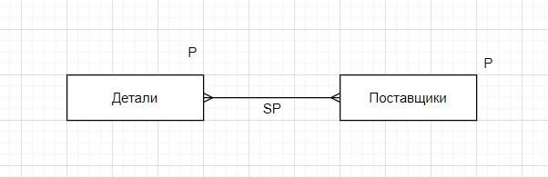

# Базы данных | Лекция 5 | 02.10.2021

range of SX is S\
    range of PX is P when Color = 'k'\
        range of SPX is SP\
            SX.Sname where exists SPX(SX.Sno = SPX.Sno and exists PX(SPX.Pno = PX.Pno))

* Имена поставщиков, которые не поставляют деталь под номером 2

SX.Sname where not exists SPX(SX.Sno = SPX.Snoand SPX.Pno = 2)

Вывод:
SX.Sname where for all PX (exists SPX (SPX.Pno = PX.Pno and SPX.Sno = SX.Sno))

## Аггрегатные функции

aggregate_function(exspressionх[, atr]) - внутрь агрегатной функции помещается выражение в терминах исчисления кортежей. Для функции count не нужны дополнительные атрибуты.

(SX, 'поставщик' as tag) - занесёт поставщик в каждую строку отношения SX.

|Sno|Pno|Qty|
|-|-|-|
|...|...|...|

* (SPX.Sno, SPX.Qty, PX.Weight + SPX.Qty as total(W) where SPX.Pno=PX.Pno)
* SUM(SPX, Qty) as totalQ
* (SX.Sname, count(SPX where SPX.Sno = SX.Sno) as cnt)

Условие принадлежности записи определяется в виде: R(pair, pair, ...), где R - отношение, pair - пара, представленная в виде pair := A:v, А - атрибут. v - value, значение.

SP(Sno:1, Pno:1) - истина, если Sno = 1 и Pno = 1.\
SP(Sno:Sx, Pno:Px) - на выходе будут посказаны поставки, которые происходили с определёнными поставщиками и определёнными деталями.

Пример:\
Номера поставщиков, которые зарегестрированы в городе Смоленск.\
(SX) where S(Sno:Sx, City:'Смоленск')

## Функциональные зависимости

R, XnY

|Sno|City|Pno|Qty|
|-|-|-|-|
|1|См|1|100|
|1|См|2|50|
|2|Вл|1|100|
|2|Вл|2|150|
|1|См|1|150|

Есть отношение (табличка) в этой таблице есть множество атрибутов X и Y. Тогда мы говорим, что X -> Y (функионально зависит от Y) когда одно значение из множества X связано в точности с одним значением Y.

{Sno} -> {City}
{Sno, Pno} -> {Qty}
{Sno, Pno} -> {City}

Аномалии при изменении данных:
insert
update
delete*