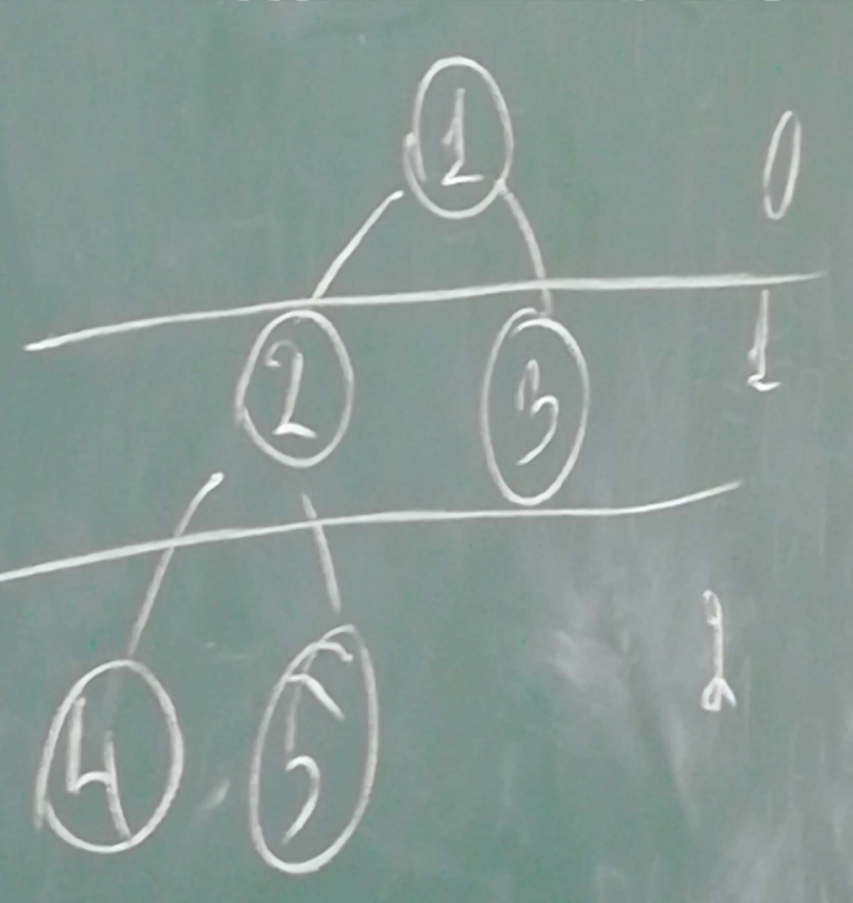
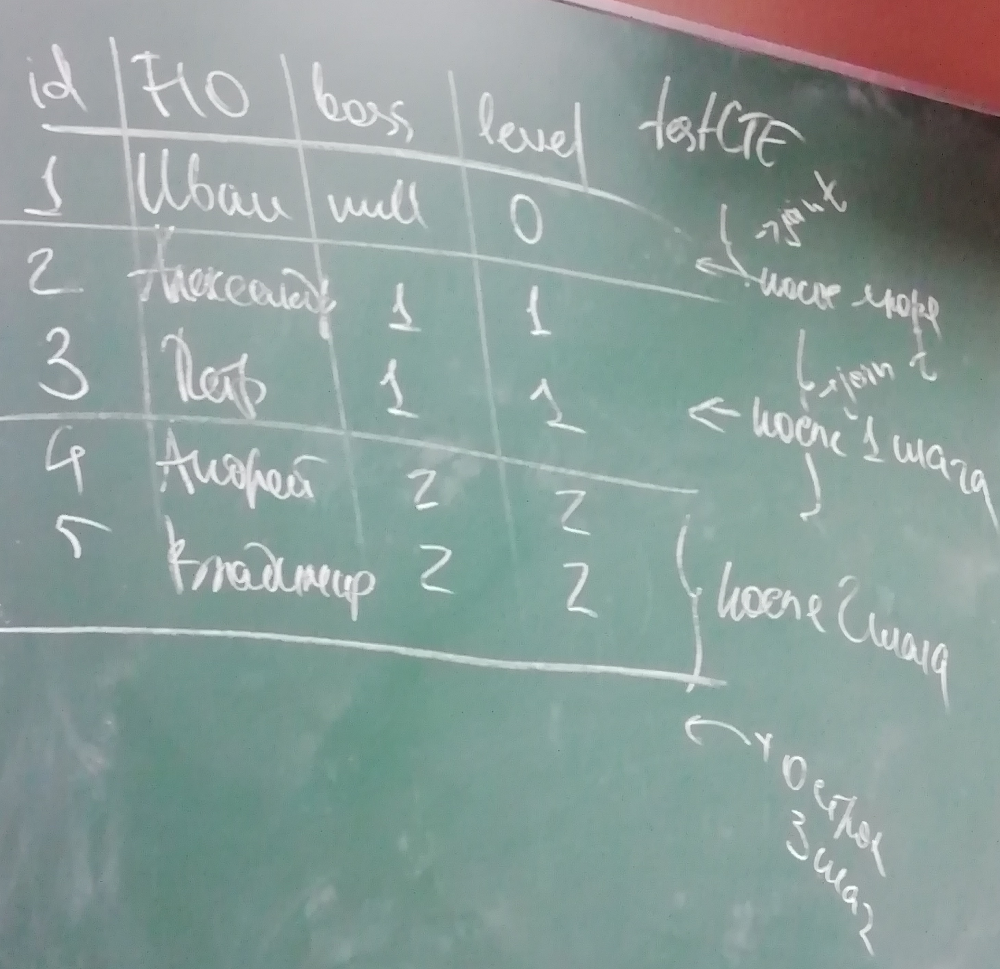

# Базы данных. Семинар №5. 06.10.2021
## Обобщённые табличные выражения

with <имя1_ОТВ> as (\
    <sql-запрос>\
)\
[, <имя2_ОТВ> as (\
    <sql-запрос>\
)]\
sql-запрос\

|#|Fio|bpss|
|-|-|-|
|1|Иван|null|
|2|Адександр|1|
|3|Петр|1|
|4|Андрей|2|
|5|Владимир|2|

# Рекурсивные запросы

Якорь:\
with [posgtres требует ключевое слово "recursive"] testCTE(id, Fio, boss, level) as(\
select id, Fio, boss, 0\
from t\
where boss is null\
\
union all\
\
Шаг:\
sleect t.id, t.Fio, t.boss, c.level + 1\
from testCTE c join t on c.id = t.boss\
)\
\
select * from testCTE\
where level = 1

Практически применяется при администрировании СУБД.\
Пример запроса для генерации данных:\
with testData(id, date) as (\
select 1, '2021-10-06'\
union all\
select 1, '2021-10-05'\
union all\
select 2, '2021-10-06'\
)

select testData - используется если нельзя создать таблицу тестовы данных, вместо реальной таблицы используется select.\

# Оконные функции
* Ранжирующие (raw_number, rant)
* Агрегатные функции (min, max, sum)
* Функции получения доступа (lead, lag) - получение доступа к текущей или предыдущей строке

Функции называются оконными так как применяются и работают в рамках определённого окна.\

|id|name|weight|color|
|-|-|-|-|
|1|Гвоздь|10|к|
|2|Винт|15|к|
|3|Гвоздь|14|к|
|4|Гвоздь|12|с|
|5|Шуруп|11|с|
|6|Шайба|11|з|
|7|Шуруп|16|з|

select id, name, weight. color\
row_number() over (order by weight) as rn1,\
row_number() pver (partition by color order by weight) as rn2\
from p

|id|name|weight|color|rn1|rn2|
|-|-|-|-|-|-|
|1|Гвоздь|10|к|1|1|
|2|Винт|15|к|6|3|
|3|Гвоздь|14|к|5|2|
|-|-|-|-|-|-|-|
|4|Гвоздь|12|с|4|2|
|5|Шуруп|11|с|2|1|
|-|-|-|-|-|-|-|
|6|Шайба|11|з|3|1|
|7|Шуруп|16|з|7|2|

Одинаковые элементы будут помечены одинаковым значением при использовании ранжирующих функций.

* Агрегатные функции

select id, name, weight, color,\
min (weight) over (order by weight) as m1,\
min (weight) over (partition by color order by weight) m2,\
min (weight) over (partition by color) m3\
from p\
\
order by - функция имеет накопительный эффект.

|id|name|weight|color|m1|m2|m3|
|-|-|-|-|-|-|-|
|1|Гвоздь|10|к|10|10|10|
|2|Винт|15|к|10|10|10|
|3|Гвоздь|14|к|10|10|10|
|-|-|-|-|-|-|-|
|4|Гвоздь|12|с|10|12|11|
|5|Шуруп|11|с|10|11|11|
|-|-|-|-|-|-|-|
|6|Шайба|9|з|9|9|9|
|7|Шуруп|16|з|9|9|9|

Пример:\
Что имеется:
t
|id|date|sum|
|-|-|-|
|1|2021-10-03|500|
|1|2021-10-04|150|
|1|2021-10-05|700|
|2|2021-10-02|500|
|2|2021-10-06|100|
|1|2021-10-06|1200|

Что мы хотим получить:
|id|date|sum|
|-|-|-|
|1|2021-10-03|500|
|1|2021-10-04|650|
|1|2021-10-05|1350|
|1|2021-10-06|1550|

select id, dt, sum(sumE) over (partition by id order by dt)\
from t

___
select id, name, weight, color, lag(weight) over (partition by color order by weight) l1 - предыдущее значение,
lead(weight) over (partition by color order by weight) l2 - следующее\
from p

|id|name|weight|color|l1|l2|
|-|-|-|-|-|-|
|1|Гвоздь|10|к|null|14|
|2|Винт|15|к|14|null|
|3|Гвоздь|14|к|10|15|
|-|-|-|-|-|-|-|
|4|Гвоздь|12|с|11|null|
|5|Шуруп|11|с|null|12|
|-|-|-|-|-|-|-|
|6|Шайба|11|з|null|16|
|7|Шуруп|16|з|9|null|

select id, name, weight, color\
min(weight) over (partition by color) m1,\
max(weight) over (partition by name) m2,\
sum(weight) over (partition bu color order by id) s1\
from p

|id|name|weight|color|m1|m2|s1|
|-|-|-|-|-|-|-|
|1|Гвоздь|10|к|10|10|10|
|2|Винт|15|к|10|15|15|
|3|Гвоздь|14|к|10|10|39|
|-|-|-|-|-|-|-|
|4|Гвоздь|12|с|11|10|12|
|5|Шуруп|11|с|10|11|23|
|-|-|-|-|-|-|-|
|6|Шайба|9|з|9|9|9|
|7|Шуруп|16|з|9|11|25|

Пример использования lag, lead:\
|id|date|type|
|-|-|-|
|1|2021-10-06 9:00|1|
|2|2021-10-06 10:00|2|
|3|2021-10-06 10:15|1|
|4|2021-10-06 19:00|2|

scd1-версионность, так как по одному полю\
Необходимо преобразовать в таблицу вида:
|id|df|dt|type|
|-|-|-|-|
|1|2021-10-06 9:00|2021-10-06 10:00|1|
|2|2021-10-06 10:00|2021-10-06 10:15|2|
|3|2021-10-06 10:15|2021-10-06 19:00|1|

scd2 - версионность по двум полям

with testSCD2(id, df, type, dt) as (\
select id, dt, lead(dt) over (partition by id order by dt)\
)\
from t

select id, df, dt\
from testSCD2\
where type = 1

|id|df|type|dt|
|-|-|-|-|
|1|2021-10-06 9:00|1|2021-10-06 10:00|
|2|2021-10-06 10:00|2|2021-10-06 10:15|
|3|2021-10-06 10:15|1|2021-10-06 19:00|
|4|2021-10-06 19:00|2| null |