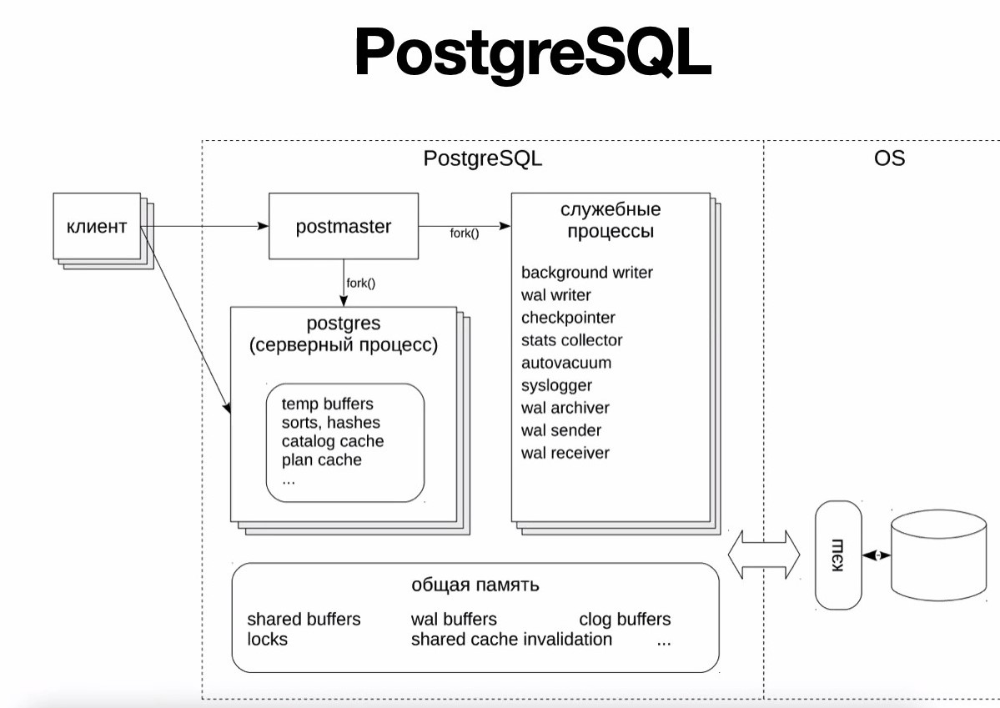
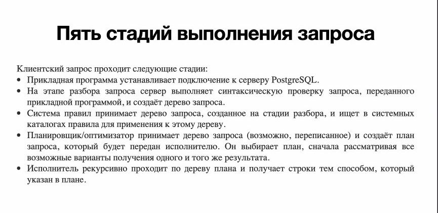
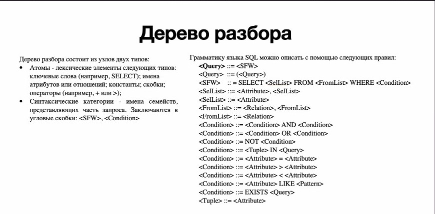
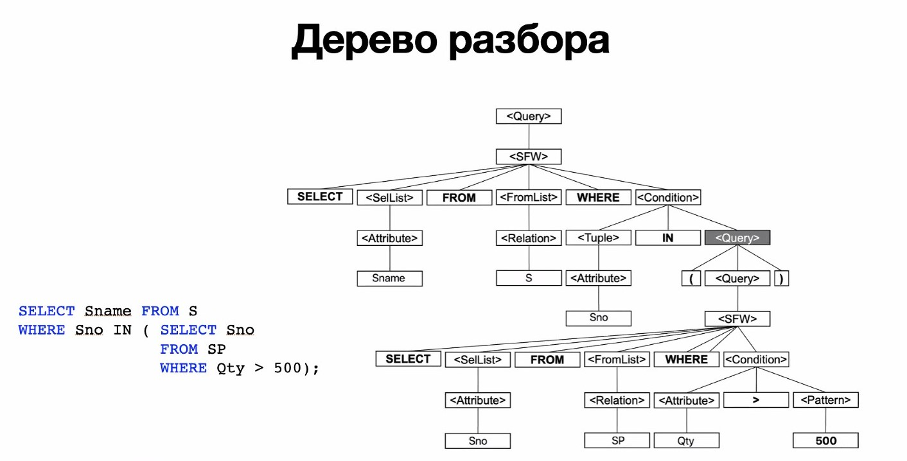
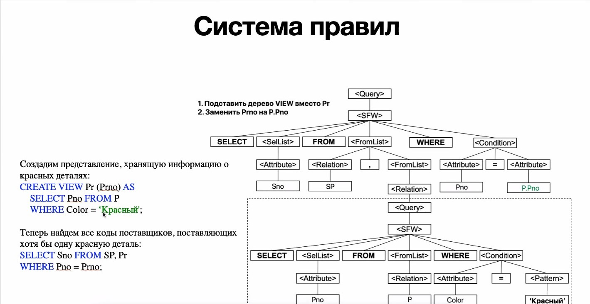

# Базы данных. Семинар 9. 10.11.2021
## Оптимизация запросов

Оптимизация запросов нужна если требуемые ресурсы выходят за рамки выделяемых СУБД.

Кэш-каталог - структура, позволяющая сохранять те запросы, которые наиболее чаще всего выполняются. Если запрос выполняется несколько раз, то его план не строится заново, а просто достаётся из памяти. 

* На этапе разбора мы избавляемся от переменных, представлений и тд, приводя запрос к виду базовых таблиц

Анализ запроса можно проводить с помощью explain analyze 

Пример:\
explain analyze\
select * from store.spj s\
where s.sno = 1\