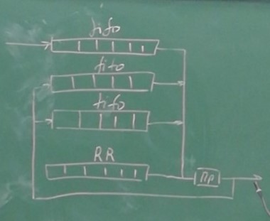
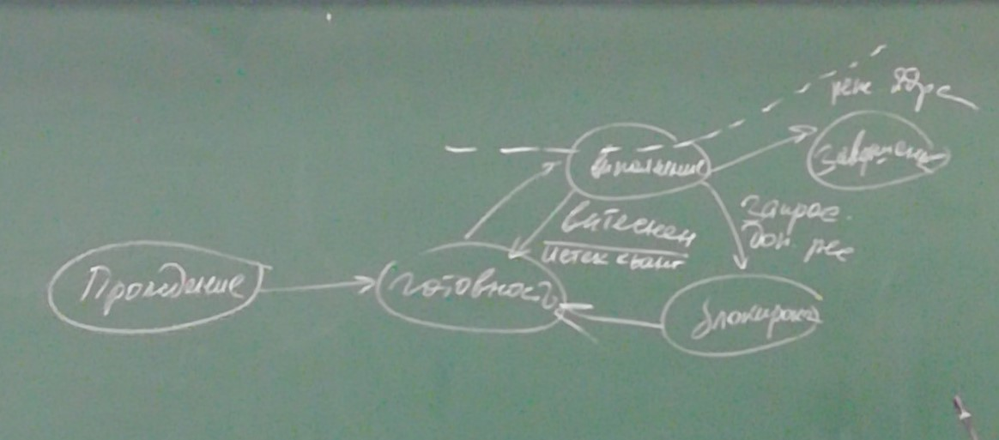
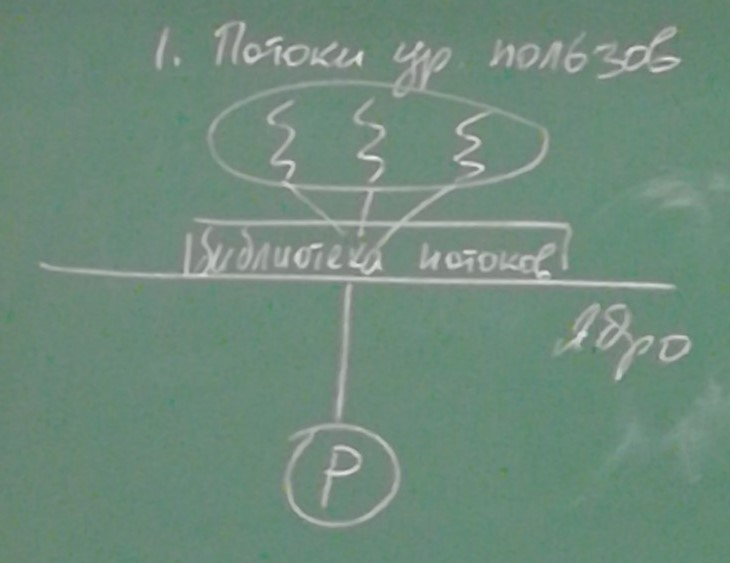
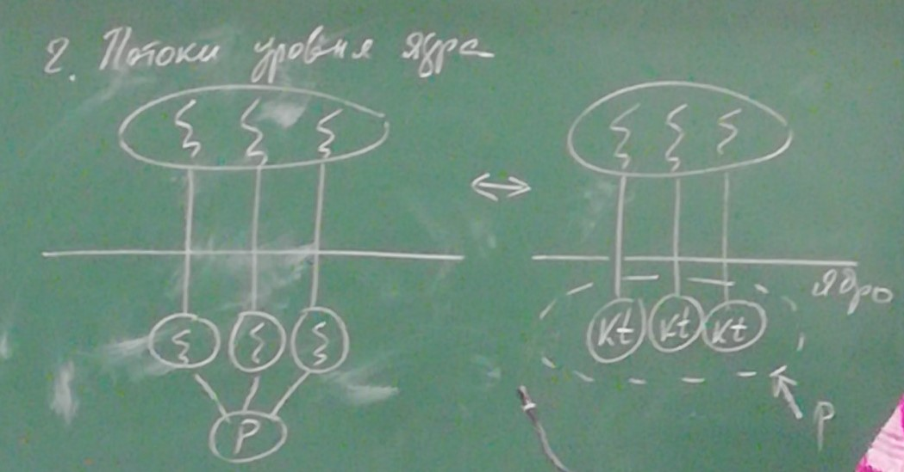
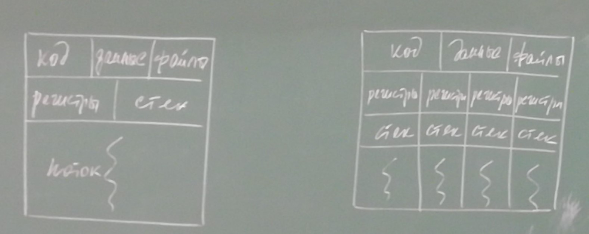
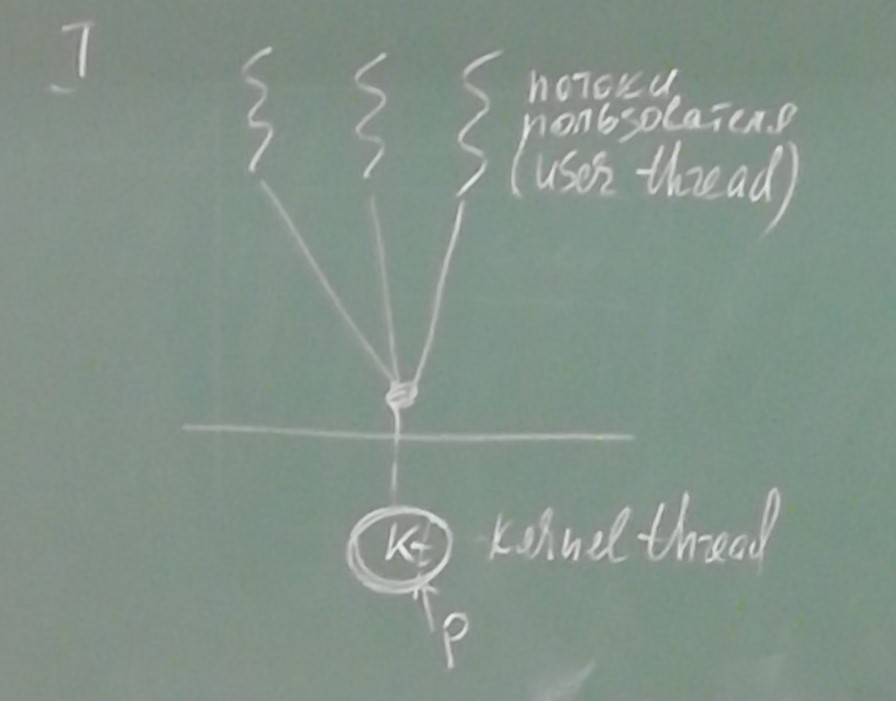
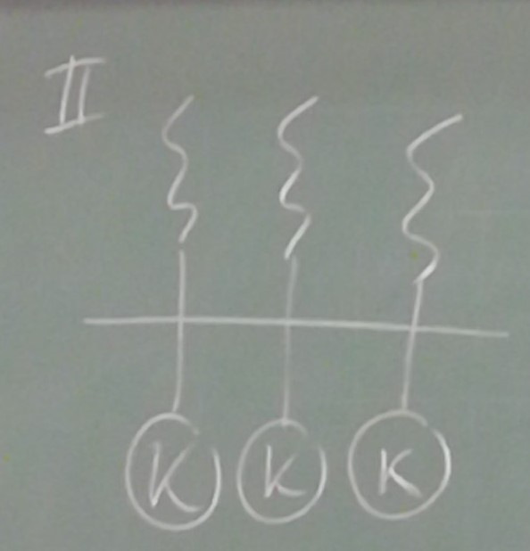
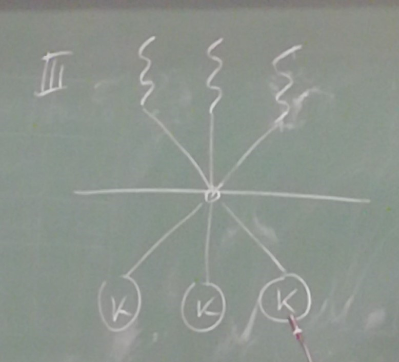
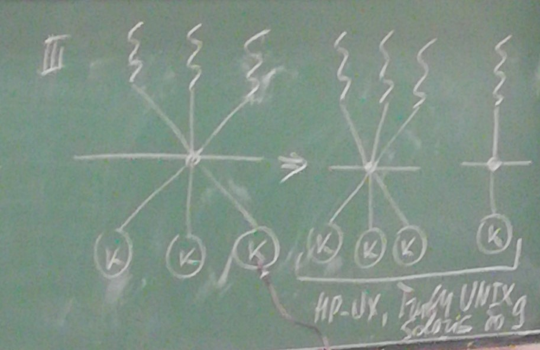

 # Операционные системы. Лекция 4

 

 Алгоритм выполняется за отведённый квант времени, если процесс не был выполнен, то он переходит в очередь с более низким приоритетом, если алгоритм попадает в самую низкоприотиретную очередь, в которой находится холостой процесс (который нужен т.к. система не может ничего не делать).

 

Аппаратный контекст - регистры, которые надо сохранить, чтобы продолжить выполнение процесса.

Полный контекст. Состоит из аппаратного контекста и информации о выделенных процессу ресурса.

Переключение аппаратного контекста поддерживается аппаратно.

Переключение полного контекста - затратной действие. Происходит довольно часто, причины - истёк квант времени, блокировка или выполнения процесса. 

Для сокращения затрат, связанных с переключением контекста было предложено использовать потоки.

* Поток - непрерываная часть кода программы, которая может выполняться параллельно с другими частями кода программы.

Классификация потоков:
Существует два типа потоков, которые поддерживаются в современных системах. Причём в некоторых системах поддерживаются оба типа. Это потоки уровня пользователя и потоки уровня ядра (потоки пользователя и потоки ядра).

Потоки уровня пользователя - поддерживаются с помощью специальных библиотек уровня пользователя. Никакой поддержки ядра у таких потоков нет. Библиотека предоставляет ядру набор вызовов для работы с потоками и система работает с потоками.

1. Потоки уровня пользователя

Для работы с потоками уровня пользователя нужны специальные библиотеки уровня пользователя. Программа делится пользователем на потоки. Потоки управляются с помощью библиотеки, ядро в этом не учавствует. Функции потоков - создание, выполнения, переключения, функции контекста, обеспечение средствами взаимодействия. 

2. Потоки уровня ядра

Ядра занимается управлением данных потоков. В результате выполнения процессорное время получают потоки, т.е. в очереди к процессору стоят потоки. Поток владеет счётчиком команд (аппаратным контекстом). Поток выполняется команда за командой. Поток запрашивает ресурсы. При этом поток не имеет своего адресного пространства и выполняется в адресном пространстве процесса. В результате выполняясь поток запрашивает дополнительную память, но этот ресурс принадлежит процессу. 

В очередь к процессору выстраиваются потоки, но никак не учитывается принадлежность программе.

## Однопоточная и многопоточная модели процессы

Однопоточная модель имеет право на существование, поскольку с появлением многопоточности для единообразия управления выполнения работы системы. Считается что если нет никаких других потоков выполняется один главный поток.

Структура, описывающая процесс называется блоком управления процессом (дескриптор управления процессом). Для управления потоком существует стркутура, описывающая поток. Владельцем ресурсов в системе остаётся процесс. Поэтому данный процесс называется единицей декомпозицией системы.

Файл - средство долговременного хранения информации. Владельцем открытых файлов является процесс. Файлы открывают потоки, но они принадлежат процессу. 

Потоки одной и той же программы могут выполняться параллельно разными ядрами.

Потоки полезны в современном программировании если:
1. процесс имеет несколько задач, которые можно выполнять независимо друг от друга. 
2. особенно полезно, когда одна задача может блокироваться в то время как другие задачи могут продолжать выполняться.

Достоинства многопоточности:
1. Отзывчивость - один из потоков может обеспечивать быстрый отклик на действия пользователя в то время как другой поток блокирован либо выполняет большой объём вычислений.
2. Разделение ресурсов - по умолчанию потоки разделяют код данные и ресурсы, что позволяют потокам выполняться параллельно в одном адресном пространстве.
3. Экономичность - при использовании потоков переключение контекста при управлении потоками происходит значительно быстрее, чем переключение контекста при использовании процессов.
4. Маштабируемость - однопоточные процессы могут выполняться на одном процессоре, в то время как многопоточные приложения в многопроцессорных системах могут выполняться на разных процессорах одновременно. Соответсвтенно время выполнения многопоточных приложений в многопроцессорных системах будет меньше.

Для многопоточных приложений существует пять областей, в которых многопроцессорность требует решения определённых проблем.
1. Правильное распараллеливание приложения - разработчик должен выбрать процессы для распараллеливания задачи. Эффективность напрямую зависит от этого выбора. 
2. Сбалансированность - поиск задач, которые имеют одинаковую или близкую по объёму функциональность - не следует тратить потоки на тривиальные задачи.
3. Разделение данных - неправильное разделение данных может приводить к ошибкам или потере данных при взаимодействии параллельных потоков.
4. Зависимость данных - одна задача может зависеть от результата выполнения другой задачи. В этом случае выполнение этих задач должно быть синхронизировано для того, чтобы доступ к данным выполнялся в правильном порядке. 
5. Тестирование и отладка - очевидно, что в многопоточных приложениях реализация тестирования и отладки будет более сложной из-за возможностей возникновения гонок (race condition). В многопоточных приложениях обнаружение ошибок при взаимодействии потоков становится более сложным.

Типы параллелизма.

Теоретически имеется два разных пути для распараллеливания нагрузки. Параллелизм данных и параллелизм задач. 

Распаралелливание данных - разделение данных между несколькими ядрами и выполнения одних и тех же задач (одной и той же последовательности обработки этих данных) для каждого подмножества данных.
Разделение задач - выделение задач, которые выполняются параллельно.

Рассматривается 4 модели
1. Многие к одному

Если блокируеся один поток, то блокируется весь процесс. Т.к. нет потоков ядра, то система видит данное приложение, как однопоточное.
2. Один к одному

Создаются отдельные потоки ядра для каждого потока пользователя. Отсутсвуют проблемы первой модели, когда блокировка одного потока приводит к блокировки всех потоков. Накладные расходы системы по управлению такой моделью будут выше. Большинство реализаций этой модели ограничивают количество потоков в системе, которые могут быть созданы. Данная модель реализована в Windows (с 95) и Linux
3. Многие ко многим

Данная модель мультиплексирует любое количество потоков пользователя на равное или меньшее количество потоков ядра. При этом пользователь никаких ограничений по количеству создаваемых потоков не имеет. Блокировка одного потока не приводит к блокировке всего процесса. Процессы могут разделяться между множеством процессоров.

Популярной вариацией данной модели является двухуровневая модель.
