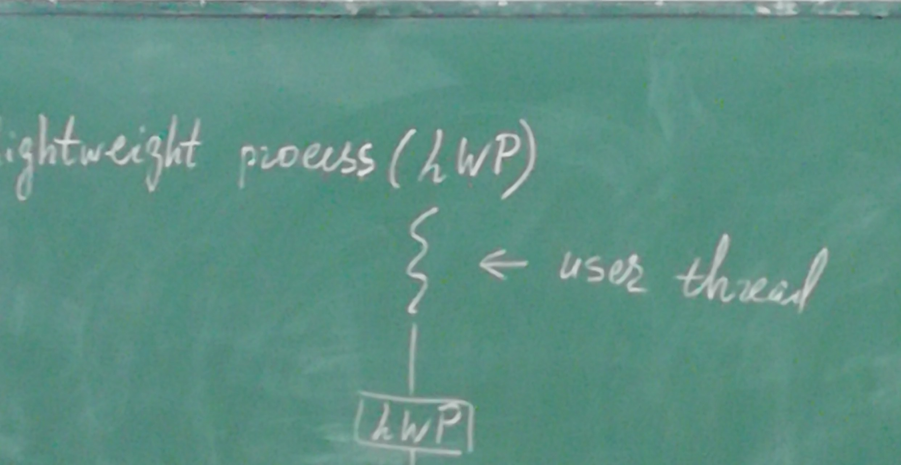
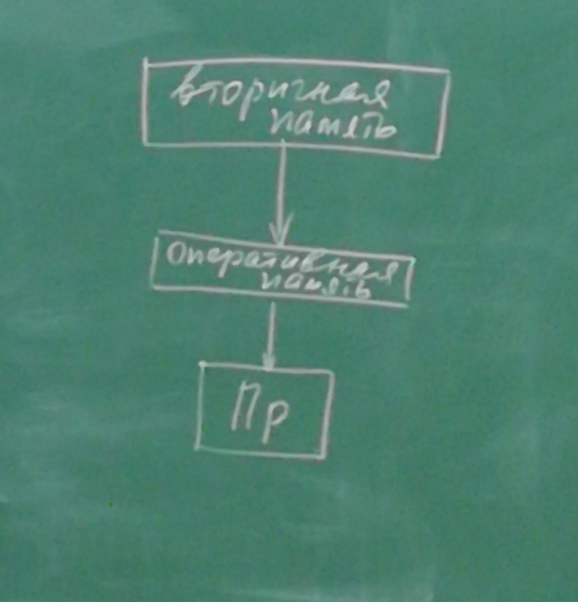
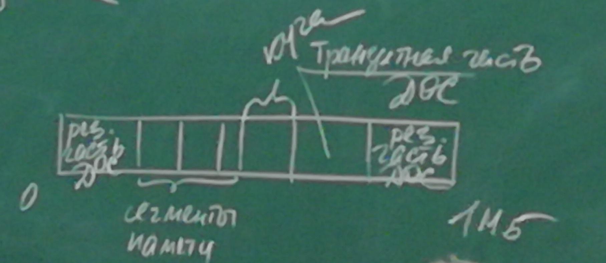
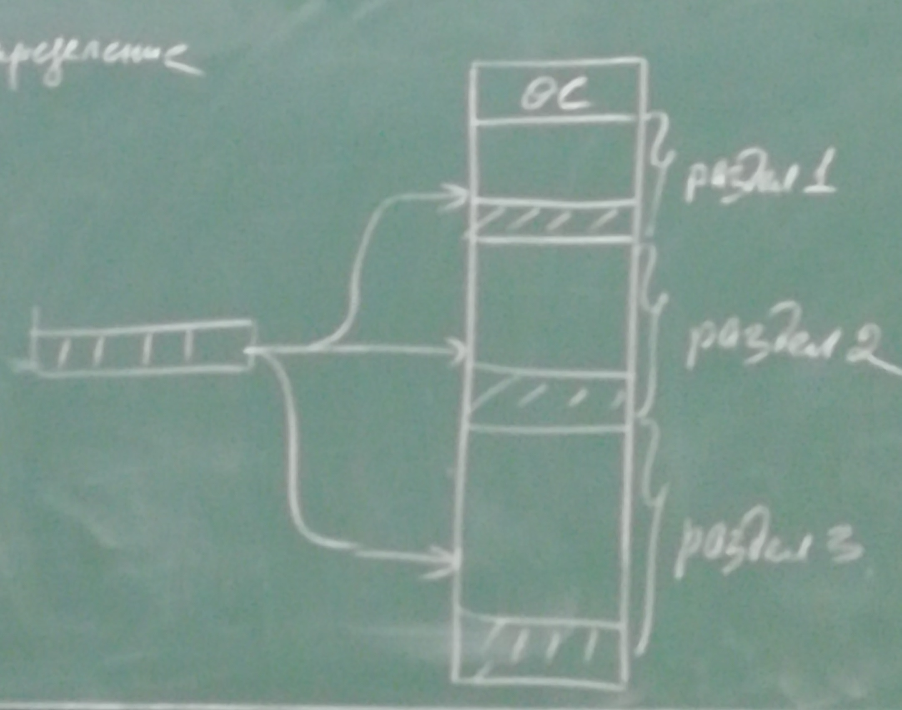
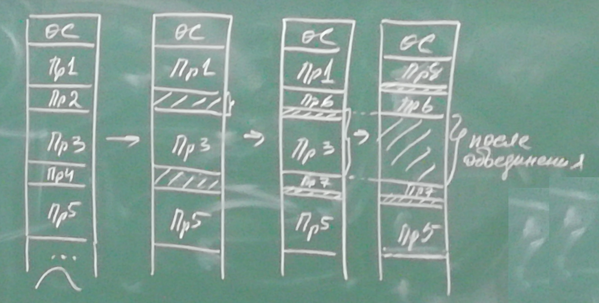
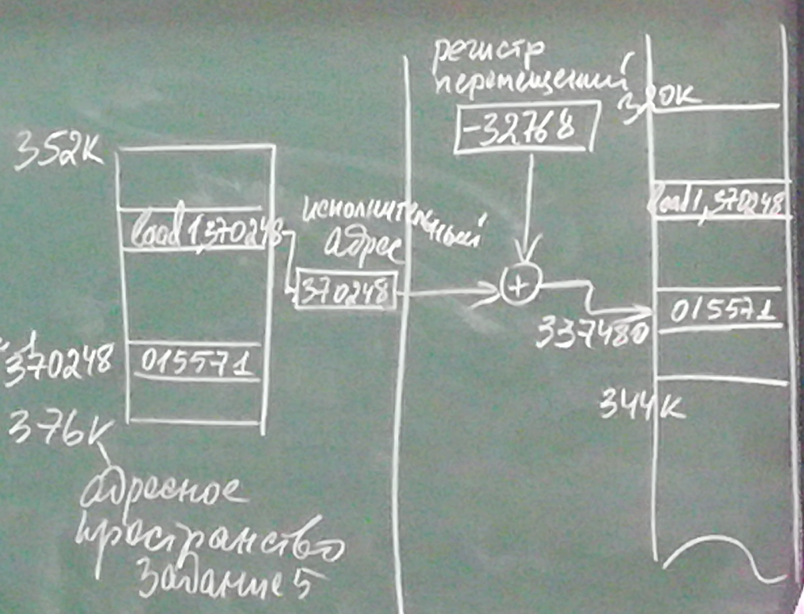
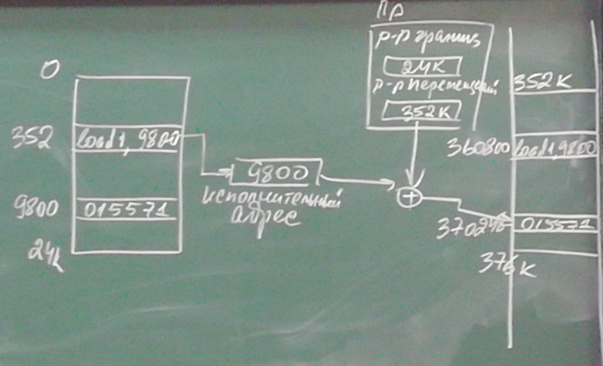

# Операционные системы. Лекция 5. 11.10.2021
## Библиотеки потоков
Библиотеки потоков предоставляют программистам API функции для создания и управления потоками. Эти библиотеки могут быть реализованы как в пространстве пользователя, так и в пространстве ядра. Библиотеки реализованные в пространстве пользователя включают API функции исключительно выполняемые в пространстве пользователя без поддержки ядром. Библиотеки пространства ядра включают системные вызовы.\
 На сегодняшний день имеется три основные библиотеки:\
1. POSIX Pthreads - может выполнять действия как в пространстве пользователя, как и в пространстве ядра как расширение стандарта POSIX => зависима от OС.
2. Win32 threads - реализована как библиотека пространства ядра (уровень ядра) в операционных системах Windows => зависима от ОС.
3. Jave threads - т.к. java выполняется на так называемой java-виртуальной машине, реализация потоков зависит от виртуальной машины (нет разницы, как она выполнена) => кроссплатформенность.

\
POSIX standart (IEEE 1003.1) - этот стандарт определяет спецификацию pthreads, но не реализацию.\
Доступно на solaris, linux, Mac OSX, Tru64.\
Через общедоступный домен существует разделение для windows.
\
\
Система вызовов:\
POSIX - pthread_create([params]);\
Windwos - ThreadHandle = CreateThread([params]);\
Все программы java используют потоки, даже однопоточные программы.\
Для Apple существует так называемый GCD - Grand Central Dispatch.
* Основной проблеммой многопоточных систем является взаимодействие потоков или процессов.

Lightweight process (LWP) - 

Многие реализации поддерживают процесс как виртуальный интерфейс между потоками пользователя и потоками ядра в модели многие ко многим. Этот виртуальный процесс имеет имя Lightweight process.\
Приложение может отображать потоки уровня пользователя на доступный lightweight_process.
LWP сохраняет время создания потоков ядра. Процессорное время выполняется в естественном режиме ядра.
# Управление памятью
Когда говорят о памяти имеют в виду оперативную память. В вычислительных системах имеется иерархия памяти. Данная иерархия выстраивается по отношению к процессору. \

Ближе всего к процессору находится энергозависимая оперативная память. Соответственно архитектуре фон Неймана у процессора нет своей памяти вследствие чего он постоянно обменивается с оперативной памятью.\
В ситу того, что процессор и память делаются по разным технологиям быстродействие процессора практически на порядок превышает быстродействие памяти.\
Процессор и оперативная память - компьютер. Вторичная память для компьютера - внешнее устройство. 

* Связная распередённая память - программа занимает в памяти непрерывное адресное пространство.
* Несвязная распределённая память - прграмма может быть разлита на участки в памяти.

Исторически первым появилось связное определение. Если вспомнить однопрограммные пакетны обработки в каждый момент времени в оперативной памяти находилась одна программа.

* Виды задач управления

|ОС| |
|-|-|
|Программа|
|Свободная память|

Вертикальное управление - задача решается одинаково на всех уровнях.\
Горизонтально управление - на каждом уровне задача решается по своему.\
DOS - однопрограммная операционная система.\
\
Раскладка в операционной системе:\

\
В памяти находится две программы - приложение и операционной системы. Причём операционная система имеет две части - резидентная (постоянно в памяти) и транзитная (загружается при необходимости).
* Мультипрограммность, мультизадачноть - в памяти находится большое количество разных программ.

## Выделение памяти
Статическое выделенние

Разделы определяются статически до начала работы системы и в процессе работы их параметры не меняются.\
Формы организации очередей к разделам:
1. Каждому разделу свою очередь - проблема в оставшейся неиспользованной памяти.
2. Всей памяти одну очередь - проблема в том, что мы не знаем, в какой раздел можно загрузить программу (в большой раздел маленькую и в маленький раздел большую).

Динамическое выделение

В начале работы программы загружаются из пакета в память друг за другом. В течении времени завершается одно/несколько заданий. По завершении работы программы можно соединить два соседних свободных раздела в один.\
\
Два основных аспекта при работе динамического выделения:\
Выбор места для загрузки новой программы.\
Стратегии выбора:
1. Первый подходящий - программа загружается в первый раздел, который подходит ей по размеру.
2. Самый тесный - из всех свободных разделов будет выбран раздел ближе всего по размеру новой программы.
3. Самый широкий - выбирается самый большой раздел и в него загружается программа.

Фрагментация памяти - формирование в памяти слишком маленьких фрагментов, из-за которых не получается загрузить новые программы. Цена перезагрузки для исправления фрагментации - потеря всей проделанной работы.\
Другим решением для борьбы с фрагментацией может быть перемещение разделов памяти.\
\
Пример перемещения памяти\

Решение проблемы перемещения связано с преобразованием адреса при статической трансляции. Адресное пространство программы никак не зависит от расположения программы в памяти. В результате пришли к логическому адресному пространству.
* Любая программа считает, что она начинается с нулевого адреса.

Развивая эту мысль мы приходим к следующему результату:
