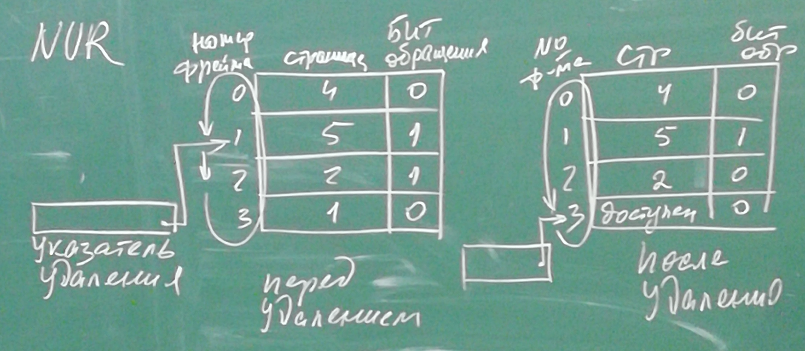
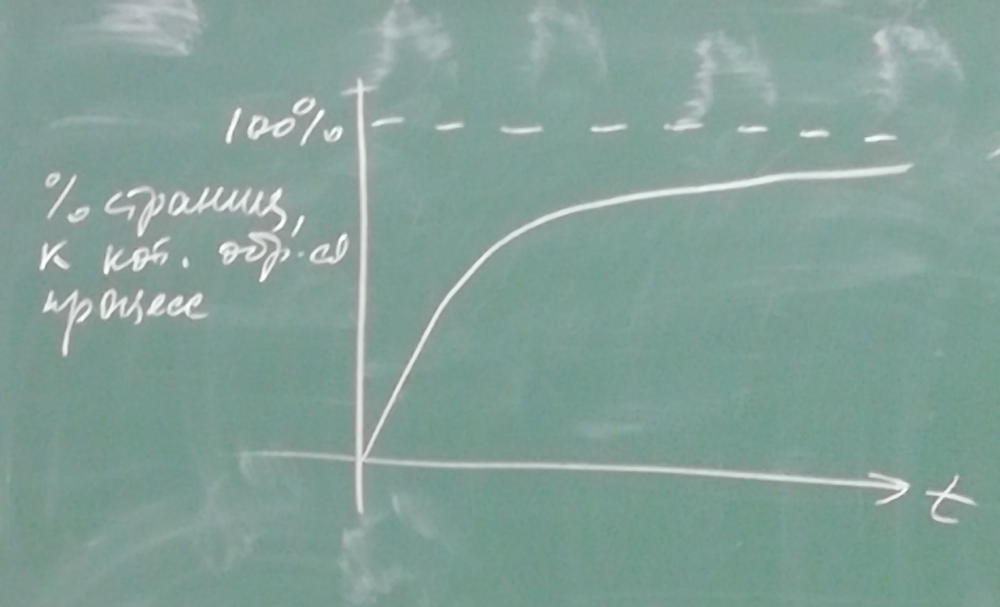
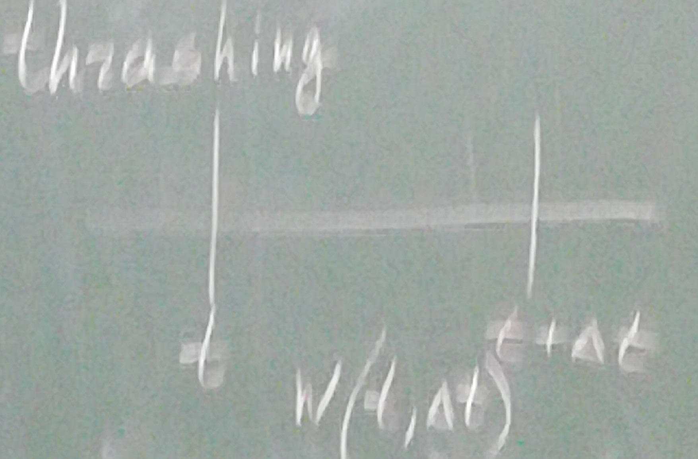
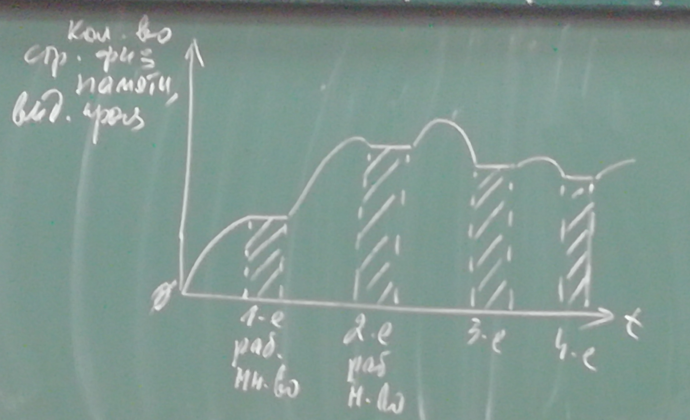
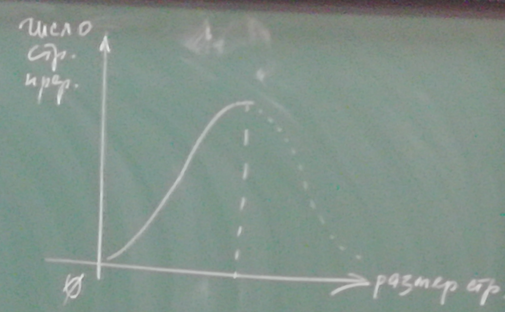
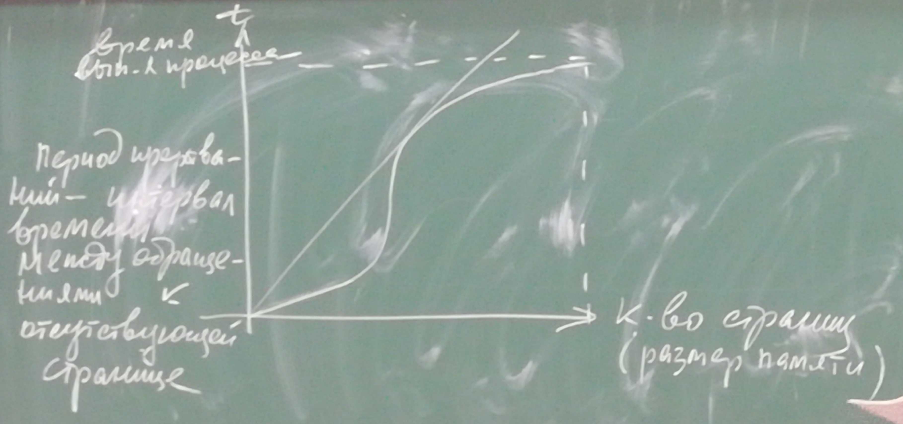

# Операционные системы. Лекция 7. 18.10.2021.
## Алгоритм вытеснения страниц LRU (Least Recently Used)

Моделирование загрузки трёх страниц:

В алгоритме LRU при каждом обращении к странице данная страница перемещается в конец очереди. При использовании временной метки метка страницы обновляется. Клетки рассматриваются как модель связного списка. Если не происходит страничного прерывания, то это называется страничная удача. 

Увеличим память на одну страницу:

В данном случае при обращении к 4 странице опять возникает страничная удача, так как 4-я таблица уже нахоидтся в памяти. Обращение к 3 странице приводит к помещению её в хвост. Обращение к 5 приведёт к вытеснению второй и т.д.

Как видно из рисунка - увеличение памяти привело к уменьшению числа страничных прерываний. Это происходит из-за соответствия алгоритма LRU свойству локальности программ. 

Свойство локальности - если обращение было к странице, то наиболее вероятно, что следующие обращения будут к этой же странице. Данное свойство следует из того, что в программах без goto существует только три вида действия - следование, ветвление, повторение. Если говорить о хранении данных, то большая часть данных (массивы) хранятся в ряде последовательных адресов. 

Свойство включения - (первые три строки второго рисунка соответствуют первым трём строкам второго) если какие-то страницы выбраны в реализации L(P, M, t), то эти же страницы будут выбраны в реализации L(P, M + 1, t).

Алгоритм LRU отнисится к классу методов вытеснения, которые называются стековыми алгоритмами. 

В реальных системах не используется в следствие крайней затратности. Т.к. при каждом действии необходимо либо редактировать временную метку или перемещать узлы связного списка. При этом обращение к страницам происходит при обращении к данным в практически в каждой команде, при этом в одной команде (при использовании косвенной адресации) обращений может быть несколько (более двух). 

### Алгоритм LFU (Least Frequency Used (Page Replacement))

В данном алгоритме используется счётчик обращений к странице, который инкрементируется при каждом обращении к странице. 

Недостаток данного алгоритма - может быть вытеснена только что загруженная страница. 

### Алгоритм NUR (Not Used Recently (Page Replacement))

Данный алгоритм является аппроксимацией алгоритма LRU. Для реализации данного алгоритма. Для его реализации для каждой страницы вводится бит обращения. Данный бит обращения периодически сбрасывается в ноль. Соответственно при обращении к странице данный бит устанавливается в единицу. Поэтому при вытеснении какой-либо страницы страница для вытеснения ищется среди страниц, у которых бит обращения был сброшен. И это показывает, что с момента последнего сброса бита обращения обращений к этой странице не было. Для реализации вводится указатель удаления. 

Слева редставлен вид после загрузки 5-й страницы. Если в этот момент необходимо удалить страницу, то проверка значений битов обращения будет выполняться со второго кадра (фрейма). Так как значение бита обращения равно 0 у первой страницы, мы её удаляем:

Также вводится бит модификации страницы, называемый (dirty). Данный бит вводится для того, чтобы избежать копирования страницы на диск. Точная копия неизменённой страницы находится на диске, и при помощи данного бита мы избегаем излишних действий копирования. 

|Бит обращения|Бит модификации|
|-|-|
|0|0|
|0|1|
|1|0|
|1|1|

В случае, когда бит обращения равен 0, а бит модификации равен 1, модификация была произведена до сброса битов обращения.

## Поведение программ и производительность

Плюс виртуальной памяти - величение мультизадачности или увеличение уровня мультипрограммирования за счёт снятия ограничений, накладываемых увеличением размера физический памяти. Недостаток - загрузка процессора соответствующими действия.

Рассмотрим график зависимости процента страниц, к которым обращается типичный процесс от времени (время от начала выполнения процесса до его завершения). 

Ассимтотически процент страниц, к которым обращается процесс, приближается к 100%, так как большая часть программ не обращается ко всем своим страницам, особенно в современных программах. Однако сам график демонстрирует важнейшую вещь - процесс какой-то отрезок времени не обращается ко всем своим страницам. Первую часть времени зависимость линейная - идёт интенсивная подгрузка страниц. После того, как большая часть нужных страниц подгружена, процесс подгрузки перестаёт быть активным.

## Теория рабочего множества

Зависимость страничных прерываний от объёма памяти является обобщённой мерой страничного поведения программы. При этом, как видно из фотографии памяти (картинка обращений процесса к памяти). Поведение процесса во времени не является стабильным и равномерным. За время своего выполнения программа обращается к разному количеству страниц. Денинг в 1968 г. предложил в качестве локальной меры производительности взять число страниц, к которым программа обращается за некоторый интервал dt (дельта t). 

w(t, dt) - working set - рабочее множество. Размер рабочего множества является монотонной функцией от dt. При увеличении dt число страниц будет стремиться к некоторому пределу l, который определяет количество страниц, необходимых процессу для эффективного выполнения. Под эффективным выполнением мы понимаем выполнение процесса без страничных прерываний. Т.е. если процессу удаётся загрузить в память своё рабочее множество, то есть - все страницы, которым он обращается в течении некоторого интервала времени dt, то процесс будет выполняться без страничных прерываний. Другими словами для того, чтобы процесс выполнялся эффективно необходимо, чтобы он мог загрузить в память всё своё рабочее множество. При этом понятно, что предсказать, какие страницы и в какой момент времени запросит процесс невозможно, но при этому реально предсказать размер рабочего множества. Если процессу не удасться это сделать, возникнет интенсивная подкачка (пробуксовка или thrashing). То есть подкачка одних и тех же страниц. 

В начальный момент процессу выделяется минимально необходимое количество страниц и процесс начинает выполнение, при этом он интенсивно подгружает нужные ему страницы до тех пор, пока в памяти не окажется первое рабочее множество. До этого момента процесс будет выполняться без страничных прерываний, если ему удалось загрузить все нужные страницы. Затем процесс продолжается и начинает формировать новое множество страниц. Так как в памяти находится страницы и из первого и второго рабочего множество, физической памяти требуется больше. После достижения второго рабочего множества новая память не требуется. Аналогичным образом процесс переходит к 4-му, 5-му и остальным рабочим множествам. 

hit rate - число удачных обращений (страничных удач), является метрикой, аналогичной working set.

Важнейшим вопросом в системах является выбор размера страницы. На выбор размера влияют две основных особенности:
1. На маленькой странице выполняется больший процент комманд.
2. Чем меньше страница, тем больше таблица страниц. 

График влияния размера страницы при фиксированном объёме памяти на число страничных прерываний: 

Из данного графика видно, что число прерываний растёт с ростом размера страницы, причём оно это делает довольно интенсивно. Это связано с тем, что чем больше размер страницы, тем меньший процент команд будет выполнен, поэтому требуется переход на другую страницу. После достижения максимума идёт спад, так как размер страницы становится достаточно большим для того, чтобы содержать всю программу целиком. 

График зависимости длительности периода между прерываниями или так называемая кривая времени жизни:

Точка, в которой прямая касается графика называется "Точка перегиба" или "Колено". Данный перегиб происходит из-за того, что в некоторый момент времени в памяти оказывается всё рабочее множество страниц процесса. Как можно увидеть, интервал между обращениями к страницам, отсутствующим в памяти, увеличивается, данный интервал называется временем жизни. Всё это косвенно подтверждает факт существования рабочего множества. Контроль количества прерываний процесса является важнейшим показателем правильного выделения памяти, под правильным выделением можно понимать необходимость предоставления процессу нужного ему количества страниц. 

Рабочим множеством можно назвать некую квоту, которая изменяется по факту запрашиваемых при выполнении процесса страниц, если у системы есть возможность эту квоту увеличить. 

## Глобальное и локальное замещение страниц

Глобальное замещение - выгрузка любой страницы любого процесса для того, чтобы процесс мог загрузить нужную страницу.

Локальное замещение - выгрузка страниц только данного процесса. 

В системах Linux есть page daemon - страничный демон. Windows - swapper. Данные инструменты используются для того, чтобы заранее выгрузить страницы, которые не используются (выгрузка страниц занимает время). В результате таких действий каждый конкретный процесс будет выполняться быстрее. 

# Управление памятью сегментами по запросу

Страница является единицей физического деления памяти. Сегмент является единицей логического деления памяти, поэтому дополнительно должен быть известен размер сегмента.