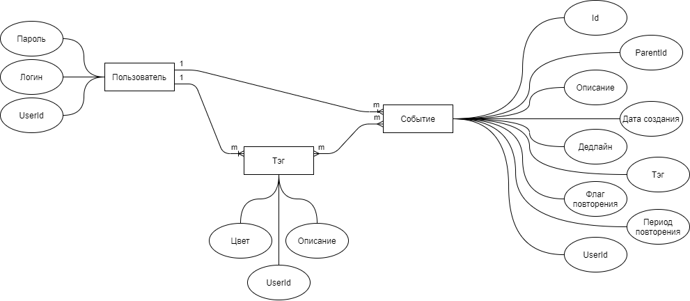

## Название проекта
Planium

## Краткое описание идеи проекта
Идея проекта - создание десктоп-приложения для эффективной самоорганизации. Разрабатываемое ПО позволяет пользователю создавать, изменять и удалять или архивировать задачи в рамках различных пространств задач (к примеру пространства "Учёба" и "Личное" содержат разные задачи, которые могут быть рассмотрены как отдельно, так и в совокупности в зависимости от желания пользователя), создавать, изменять, удалять и архивировать пространства задач, а также просматривать созданные задачи в различных форматах (календарь, список, карта разума).

## Описание предметной области
Данное программное обеспечение рассчитывается на людей, ищущих удобный, быстрый и безопасный способ организовать своё время. Ниже описаны сущности предметной области:

1. Задача - абстракция, описывающая реальную задачу. Может быть независимой от времени выполнения, либо иметь конкретные сроки. При этом описание сроков может задаваться по-разному. Статичное описание сроков - срок задаётся точным временем (пример - "Конференция", срок - 12.30, 30.02.1999), простой интервал - срок задаётся временным интервалом (пример - задача "День рождения" длится весь день, начиная с 00.00 до 00.00 следующего дня), интервал с отслеживанием - в задаче указывается время начала выполнения и время конца выполнения задачи, при этом дедлайн указывается как отдельное поле. В этом случае после начала выполнения задачи отслеживается количество прошедшего и оставшегося времени, а также прогресс выполнения подзадач, если они есть.
2. Пространство задач - абстракция, являющаяся контейнером для отдельной группы задач. Пространство задач не хранит задачи, а содержит ссылки на них.
3. Пользователь - абстракция пользователя, описывающая параметры пользователя.

## Краткий анализ аналогичных решений
|название приложения|Desktop|списки по группам|тэги|группировка по тэгам|календарь|карта разума|повторящющиеся события|уровни планирования|списки завершённых событий|
|-|-|-|-|-|-|-|-|-|-|
|Any.do|v|v|v|v|v|x|v|x|v|
|Click up|v|v|v|v|v|v|v|x|v|
|Trello|v|v|v|v|x|x|x|x|v|
|Todoist|v|v|v|v|v|x|v|x|v|
|Notion|v|v|v|v|v|x|v|x|v|
## Краткое описание целесообразности и актуальности проекта
На данный момент большая часть приложений для организации имеет гибридный форма в основном рассчитаный на группы людей и параллельно имеющий инструменты для организации одного пользователя. Вследствие этого многие инструменты оказываются попросту ненужными, если речь идёт об одном человеке. Также многие ежедневники являются частями экосистем, и хранят данные о задачах на облаке, что приводит к тому, что данные могут быть украдены и сервис может не работать без интернета.
## Use-Case

## ER-диаграмма

## Архитектурные характеристики, важные для проекта
- Расширяемость - необходимо учитывать возможность расширения приложения на случай, если потребуются новые модули для более эффективного планирования.
- Standalone - приложение разрабатывается под desktop для реализации автомномной работы на отдельно взятом устройстве.
- Быстродействие - приложение должно быть оптимизировано достаточно для того, чтобы пользователь мог работать с ним в режиме реального времени.